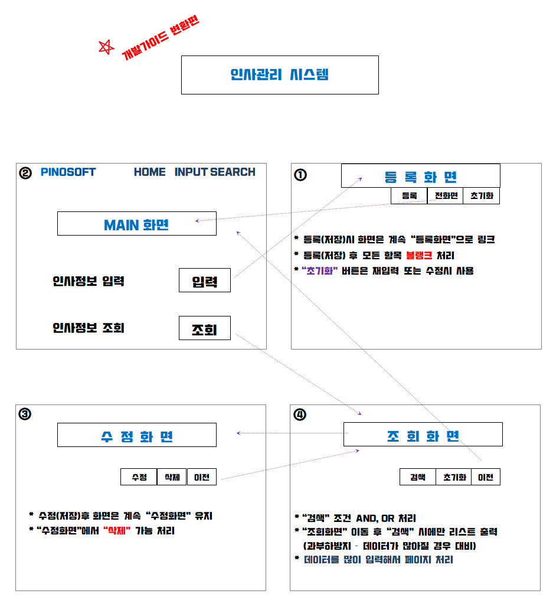
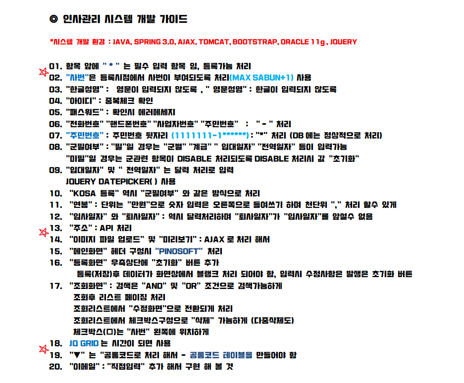
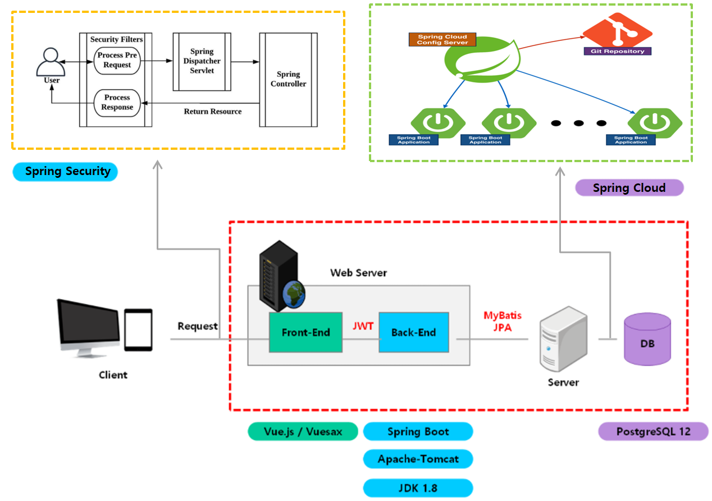
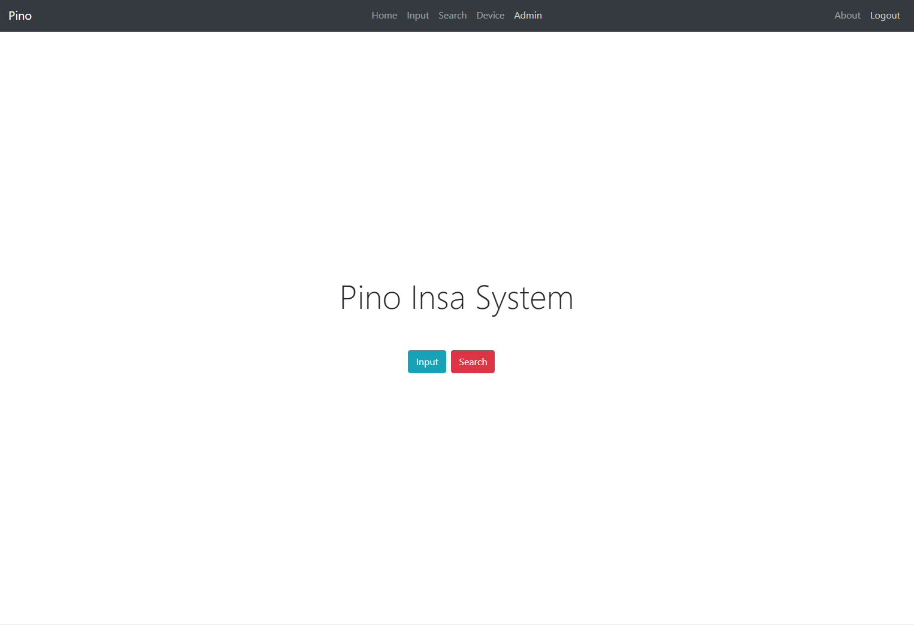

# 피노 인사 시스템

- <b>고객사</b>&nbsp;&nbsp;&nbsp;&nbsp;&nbsp;&nbsp;&nbsp;&nbsp;&nbsp;&nbsp;&nbsp;&nbsp;: 개인
- <b>참여기간</b>&nbsp;&nbsp;&nbsp;&nbsp;&nbsp;&nbsp;&nbsp;&nbsp;: 2021.11 ~ 2021.12 (1개월)
- <b>역활</b>&nbsp;&nbsp;&nbsp;&nbsp;&nbsp;&nbsp;&nbsp;&nbsp;&nbsp;&nbsp;&nbsp;&nbsp;&nbsp;&nbsp;&nbsp;: 기획, 설계, 개발
- <b>O.S</b>&nbsp;&nbsp;&nbsp;&nbsp;&nbsp;&nbsp;&nbsp;&nbsp;&nbsp;&nbsp;&nbsp;&nbsp;&nbsp;&nbsp;&nbsp;&nbsp; : Win
- <b>언어</b>&nbsp;&nbsp;&nbsp;&nbsp;&nbsp;&nbsp;&nbsp;&nbsp;&nbsp;&nbsp;&nbsp;&nbsp;&nbsp;&nbsp; : Java
- <b>DBMS</b>&nbsp;&nbsp;&nbsp;&nbsp;&nbsp;&nbsp;&nbsp;&nbsp;&nbsp;&nbsp;&nbsp;&nbsp;: Oracle
- <b>Tool</b>&nbsp;&nbsp;&nbsp;&nbsp;&nbsp;&nbsp;&nbsp;&nbsp;&nbsp;&nbsp;&nbsp;&nbsp;&nbsp;&nbsp;&nbsp;: Eclipse
- <b>Framework</b>&nbsp;&nbsp;&nbsp;&nbsp;: Spring
- <b>업무내용</b>&nbsp;&nbsp;&nbsp;&nbsp;&nbsp;&nbsp;&nbsp;&nbsp;: 전직장인 피노소프트에 신입사원이 입사하게 되면 인사프로젝트를 2주간 실습을 진행하게 되는데, 이 부분에 대한 설명과 완성 모델이 필요해서 만들었고 직원들이 파견을 각자 나가게 되면 장비를 쉽게 파악할 수 있도록 기능을 같이 넣어 만든 웹 사이트다. (http://www.pinoinsa.com/) 방문용 id는 user, pw는 1234

&nbsp;&nbsp;&nbsp;
# 프로젝트 개요
- &nbsp;&nbsp;&nbsp;
- &nbsp;&nbsp;&nbsp;
- &nbsp;&nbsp;&nbsp;

# 프로젝트 시연
- 시연동영상 (아래 이미지를 클릭하시면 유튜브로 이동합니다)   

